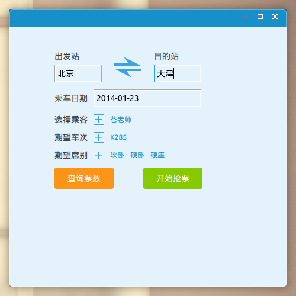
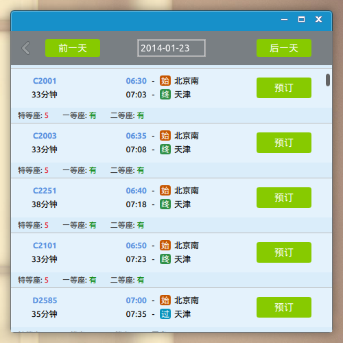

12306抢票客户端-PyQt5实现
=============================

安装依赖：
--------

```
pip install requests 
```
或
```
easy_install requests 
```

关于PyQt5
---------
Linux, Mac可以从[iverbankcomputing](http://www.riverbankcomputing.com/software/pyqt/download5)下载
Windows版不能使用riverbank官方的, 因为官方的PyQt5没有编译OpenGL, 可以下载我自己编译的版本[PyQt5-5.2-gpl-Py2.7-Qt5.2.0-x32.exe](http://pan.baidu.com/s/1dDDZiHr)

跨平台
---------
经测试可以在Mac, Linux, Windows上运行

关于Python
----------
Python 2.7最佳, 兼容Python 3.x

试用
------
可以下载我使用cx_freeze打包好的程序在Windows平台上试用: [EVTicket-0.9.exe](http://pan.baidu.com/s/1qWjQ8US#dir/path=%2FTicket)


部分截图
--------



